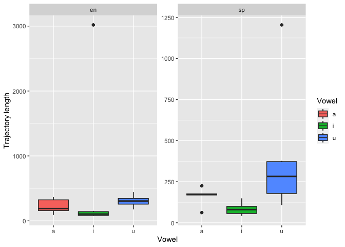
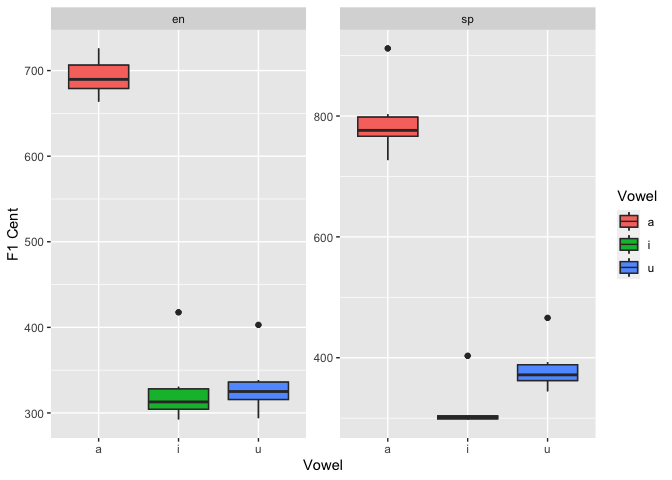
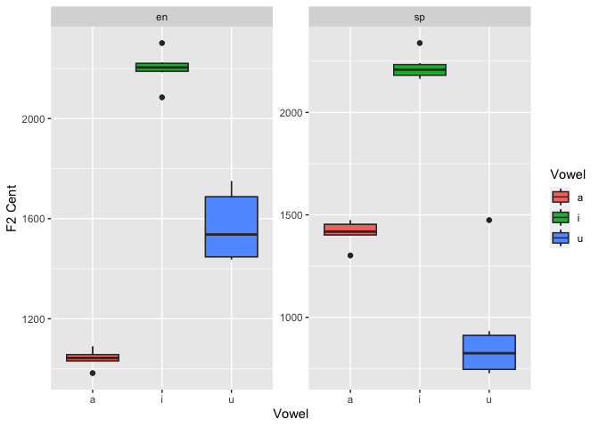
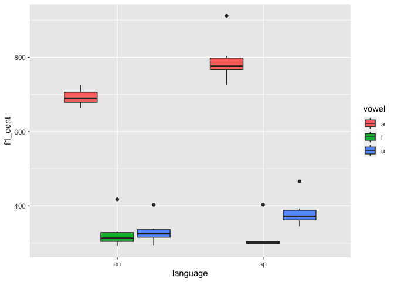
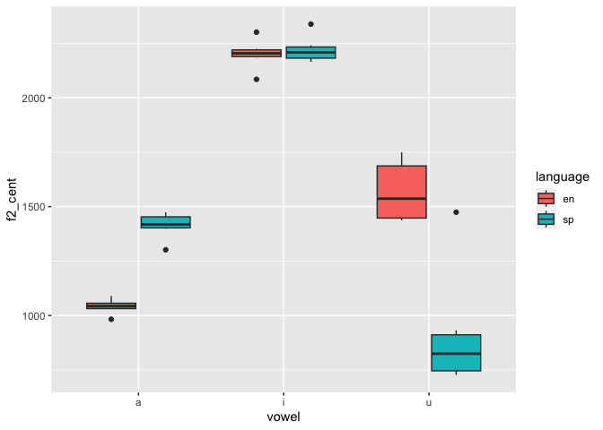
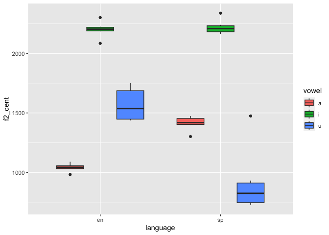
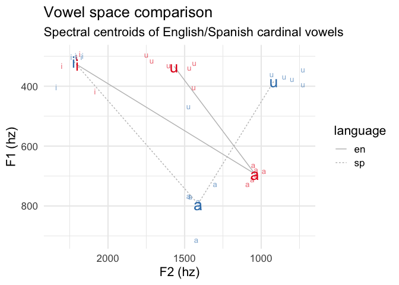

# Programming assignment 3
2024-03-29

    ── Attaching core tidyverse packages ──────────────────────── tidyverse 2.0.0 ──
    ✔ dplyr     1.1.4     ✔ readr     2.1.5
    ✔ forcats   1.0.0     ✔ stringr   1.5.1
    ✔ ggplot2   3.4.4     ✔ tibble    3.2.1
    ✔ lubridate 1.9.3     ✔ tidyr     1.3.1
    ✔ purrr     1.0.2     
    ── Conflicts ────────────────────────────────────────── tidyverse_conflicts() ──
    ✖ dplyr::filter() masks stats::filter()
    ✖ dplyr::lag()    masks stats::lag()
    ℹ Use the conflicted package (<http://conflicted.r-lib.org/>) to force all conflicts to become errors
    Loading required package: usethis

``` r
dat <- read_csv("./data/vowel_data.csv")
```

    Rows: 36 Columns: 17
    ── Column specification ────────────────────────────────────────────────────────
    Delimiter: ","
    chr  (4): id, item, vowel, language
    dbl (13): f1_cent, f2_cent, tl, f1_20, f1_35, f1_50, f1_65, f1_80, f2_20, f2...

    ℹ Use `spec()` to retrieve the full column specification for this data.
    ℹ Specify the column types or set `show_col_types = FALSE` to quiet this message.

``` r
means <- dat %>%
  group_by(vowel, language) %>%
  summarise(f1 = mean(f1_cent), f1sd = sd(f1_cent), f2 = mean(f2_cent), f2sd = sd(f2_cent), tl = mean(tl), tlsd = sd(tl))
```

    `summarise()` has grouped output by 'vowel'. You can override using the
    `.groups` argument.

``` r
# Trajectory length as a function of vowel anf language

dat %>%
  ggplot(aes(x = vowel, y = tl, fill = language)) +
  geom_boxplot()
```



``` r
dat %>%
  ggplot(aes(x = language, y = tl, fill = vowel)) +
  geom_boxplot()
```



``` r
# F1 as a function of vowel and language

dat %>%
  ggplot(aes(x = vowel, y = f1_cent, fill = language)) +
  geom_boxplot()
```



``` r
dat %>%
  ggplot(aes(x = language, y = f1_cent, fill = vowel)) +
  geom_boxplot()
```



``` r
# F2 as a function of vowel and language

dat %>%
  ggplot(aes(x = vowel, y = f2_cent, fill = language)) +
  geom_boxplot()
```



``` r
dat %>%
  ggplot(aes(x = language, y = f2_cent, fill = vowel)) +
  geom_boxplot()
```



``` r
dat_long <- dat %>%
  pivot_longer(cols = f1_cent:tl, names_to = "measure", values_to = "val") %>%
  #group_by(language, measure) %>%
  #summarise(avg = mean(val)) %>%
  ggplot(aes(x = measure, y = val, fill = as.factor(vowel))) +
  geom_point() +
  facet_wrap(~ measure, scales = "free_y") +
  geom_boxplot() +
  labs(x = "Measure", y = "Average Value", fill = "Vowel")
```

``` r
#| label: Spectral centroids of English/Spanish cardinal vowels
#| fig-retina: 2
#| fig-height: 5
#| out-width: "100%"
#| eval: true

vowel_means <- dat |> 
  group_by(vowel, language) |> 
  summarize(f1_cent = mean(f1_cent), f2_cent = mean(f2_cent)) |> 
  ungroup() |> 
  mutate(order = case_when(vowel == "i" ~ 1, vowel == "a" ~ 2, TRUE ~ 3), 
         vowel = forcats::fct_reorder2(vowel, vowel, order)) |> 
  arrange(order)
```

    `summarise()` has grouped output by 'vowel'. You can override using the
    `.groups` argument.

``` r
dat |> 
  mutate(vowel = forcats::fct_relevel(vowel, "u", "a", "i")) |> 
  ggplot() +
  aes(x = f2_cent, y = f1_cent, color = language, label = vowel) + 
  geom_text(size = 3.5, alpha = 0.6, show.legend = F) + 
  geom_path(
    data = vowel_means, 
    aes(group = language, lty = language), 
    color = "grey"
  ) + 
  geom_text(data = vowel_means, show.legend = F, size = 7) + 
  scale_y_reverse() + 
  scale_x_reverse() + 
  scale_color_brewer(palette = "Set1") + 
  labs(
    title = "Vowel space comparison", 
    subtitle = "Spectral centroids of English/Spanish cardinal vowels", 
    y = "F1 (hz)", 
    x = "F2 (hz)"
  ) + 
  theme_minimal(base_size = 16)
```



# Answers to script questions

**A. Examine the portion of the script you see below. In your own words
what does this section do and why does it work? Demonstrate that you
understand the code…**

vonset = Get starting point: 2, 2 voffset = Get end point: 2, 2
durationV = voffset - vonset per20 = vonset + (durationV \* 0.20) per35
= vonset + (durationV \* 0.35) per50 = vonset + (durationV \* 0.50)
per65 = vonset + (durationV \* 0.65) per80 = vonset + (durationV \*
0.80)

What this code is doing is calculating the percentages of a duration
between two points. First, ‘vonset’ and ‘voffset’ establish the start
and the endpoint of a given space. In this case, and based on what
appears in the dataset, it marks the start and the endpoint of the
vowel. The, it calculates the duration of that vowel by calculating the
differences between the start and the ending point. Finally, it
calculates certain percentages of the duration.

**B. In a few short sentences describe the general outline of the
script, what the purpose is, and how it achieves this purpose (hint:
focus on the section dividers and the comments).**

The first thing the script does it to set up the output file.
Essentially, it is telling Praat to create a .csv file with a specific
number of columns (and the names of these columns) and to save it in a
specific location (path). Then, the loop starts, which is what is going
to get the data from the sound file (and the textgrid) that we have in
Praat and put it in the .csv file that it asked Praat to create in the
previous step. In this step, it is important to add the path to the
stimuli files, that is, we have to tell the script t where to look for
the sound files to get the stimuli from. Finally, the third step is to
run the loop.

**C. In a few short sentences describe how the segmenting procedure you
used this week differs from that used in pa_2. What are the advantages
and disadvantages?**

The main difference between the code used for pa_2 and pa_3 is that the
first one is divided into two separate scripts and the second one is
just one long script. Additionally, their structure and what they do are
a little different. The first portion of the script used in pa_2 is
meant to segment the master sound file into smaller sound files. The
script used for pa_3, however, does not do that. I believe this could be
a disadvantage for the script used in pa_3, given that it is useful to
segment the master sound file into smaller files for other purposes. The
first portion of the script used in pa_3, on the other hand, is used to
let the script know where and how to save the data, which is something
that the script for pa_2 also has but at the very bottom. I believe it
is more useful to have it at the begging, so that you have a clear idea
of what where you are going to save the data and how. After this first
portion, both scripts set the path to the folder where the sound files
are. The script for pa_2 is going to look for several segmented files,
whereas the script for pa_3 is going to look for just one file, the
master file. After that, the script for pa_2 does what the script for
pa_3 did at the very begging, letting the script know where and how to
save the data. After that, both scripts prepare and start/run the loop
